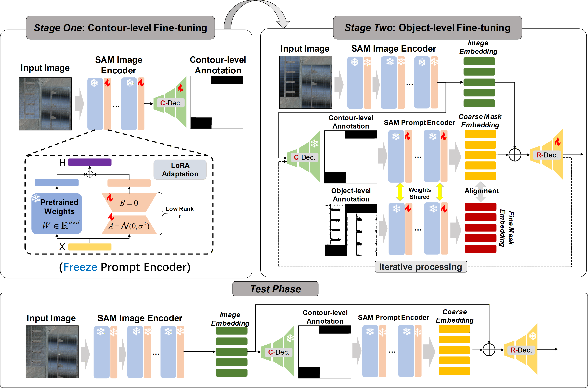
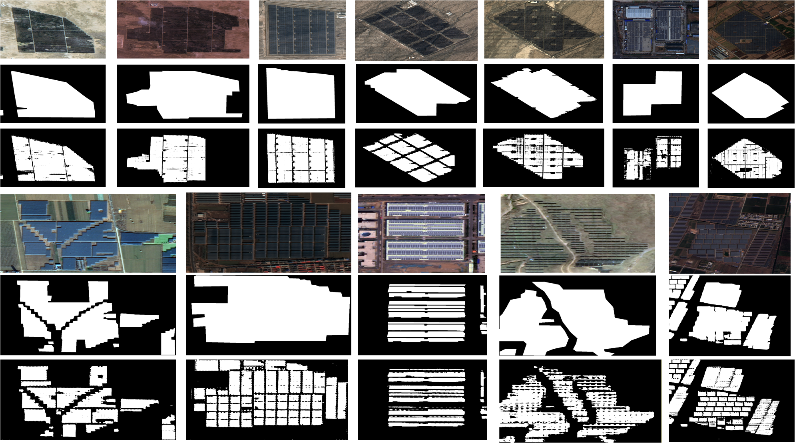
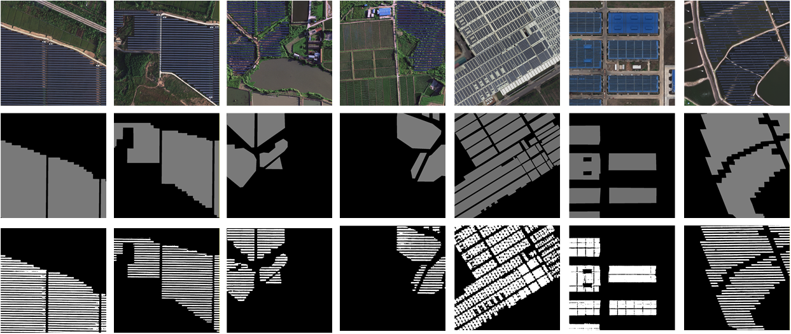

# PVPSAM: Method and Benchmark for Weakly Supervised Object-level Photovoltaic Panels Extraction in Remote Sensing Imagery

> Submitted to IEEE Journal of Selected Topics in Applied Earth Observations and Remote Sensing

---

## 📖 Introduction
In recent years, the rapid and accurate extraction of photovoltaic (PV) footprints from Remote Sensing Images (RSIs) has become a prominent research focus, particularly with Deep Learning (DL). However, as RSI resolution improves and the demand for finer extraction increases, current DL-based algorithms face substantial challenges. High-precision, fully supervised PV segmentation relies heavily on massive, high-quality object-level annotated data, which is highly time-consuming and labor-intensive to obtain. In contrast, contour-level annotations are simpler and more accessible, making them ideal for larger-scale model training. Therefore, we propose a novel two-stage weakly supervised PV segmentation framework, termed PV Progressive SAM (PVPSAM), based on the Segment Anything Model (SAM). In the first stage, we fine-tune a SAM-based Contour Decoder (C-Dec) using abundant contour-level annotated samples to learn the PV segmentation task. In the second stage, we use the segmentation outputs as dense prompts to iteratively fine-tune a Refine Decoder (R-Dec) with a small amount of object-level data, progressively achieving high-precision results. PVPSAM achieves state-of-the-art performance on our newly proposed multi-scene dataset, GF-PVCOWS. Additionally, we verify its value for optimizing traditional datasets: through our developed PVRefineTool, original contour-level annotations can be converted into refined object-level data. Our work provides a new paradigm for large-scale RSI-based PV extraction.

## ✨ Contributions

- We propose PVPSAM, a novel two-stage SAM-based method for RSI PV weakly supervised segmentation, which could adaptively generate high-precision object-level segmentation results based on low-precision contour-level annotation data.
- We collect and construct a multi-scenarios and multi-states RSI PV weakly-supervised contour-object level annotation segmentation dataset named GF-PVCOWS to support the community researches.
- Based on the proposed PVPSAM, we constructed PVRefineTool, an effective tool that can adaptively optimize and refine the contour-level segmentation results or annotations to the object-level.

## 🖼️ Overview

## 📊 Results

### Table: Experiment results on the proposed PV dataset

| Category | Method | Ratio | Precision | Recall | F1-Score | Mask IoU | Boundary IoU |
|---|---|---|---|---|---|---|---|
| **WSSS** | Directly Fine-tuning | – | 0.8615 ± 0.0032 | 0.8556 ± 0.0041 | 0.8585 ± 0.0035 | 0.7524 ± 0.0042 | 0.7315 ± 0.0045 |
| | Mask Feature Fusion | – | 0.8692 ± 0.0028 | 0.8641 ± 0.0033 | 0.8668 ± 0.0030 | 0.7635 ± 0.0038 | 0.7428 ± 0.0040 |
| | Pre-train KD (MMD) | – | 0.8733 ± 0.0025 | 0.8690 ± 0.0029 | 0.8712 ± 0.0027 | 0.7705 ± 0.0031 | 0.7501 ± 0.0035 |
| | Pre-train KD (KL Div.) | – | 0.8726 ± 0.0027 | 0.8615 ± 0.0030 | 0.8670 ± 0.0028 | 0.7693 ± 0.0034 | 0.7485 ± 0.0037 |
| | Pre-train KD (Cosine) | – | 0.8742 ± 0.0021 | 0.8726 ± 0.0024 | 0.8736 ± 0.0022 | 0.7716 ± 0.0029 | 0.7512 ± 0.0031 |
| | Pixel-Net  | – | 0.8758 ± 0.0022 | 0.8735 ± 0.0025 | 0.8746 ± 0.0023 | 0.7728 ± 0.0028 | 0.7525 ± 0.0030 |
| | CFWS  | – | 0.8774 ± 0.0019 | 0.8748 ± 0.0022 | 0.8761 ± 0.0020 | 0.7742 ± 0.0025 | 0.7538 ± 0.0027 |
| **FSSS** | Unet | 5% | 0.8545 ± 0.0045 | 0.8478 ± 0.0051 | 0.8511 ± 0.0048 | 0.7410 ± 0.0055 | 0.7205 ± 0.0058 |
| | Unet | 80% | 0.8828 ± 0.0022 | 0.8756 ± 0.0025 | 0.8792 ± 0.0023 | 0.7837 ± 0.0028 | 0.7621 ± 0.0030 |
| | Unet++ | 5% | 0.8981 ± 0.0041 | 0.8896 ± 0.0046 | 0.8938 ± 0.0042 | 0.8079 ± 0.0048 | 0.7865 ± 0.0052 |
| | Unet++ | 80% | 0.9043 ± 0.0019 | 0.8979 ± 0.0021 | 0.9011 ± 0.0020 | 0.8297 ± 0.0023 | 0.8083 ± 0.0025 |
| | DeepLabV3 | 5% | 0.8834 ± 0.0043 | 0.8767 ± 0.0048 | 0.8827 ± 0.0045 | 0.7843 ± 0.0050 | 0.7630 ± 0.0053 |
| | DeepLabV3 | 80% | 0.8989 ± 0.0020 | 0.8925 ± 0.0022 | 0.8957 ± 0.0021 | 0.8104 ± 0.0025 | 0.7892 ± 0.0027 |
| | DeepLabV3+ | 5% | 0.8805 ± 0.0042 | 0.8849 ± 0.0047 | 0.8842 ± 0.0044 | 0.7923 ± 0.0049 | 0.7710 ± 0.0051 |
| | DeepLabV3+ | 80% | 0.9086 ± 0.0018 | 0.9165 ± 0.0019 | 0.9125 ± 0.0019 | **0.8390 ± 0.0021** | **0.8175 ± 0.0024** |
| | SegNet | 5% | 0.8519 ± 0.0047 | 0.8454 ± 0.0053 | 0.8486 ± 0.0050 | 0.7371 ± 0.0057 | 0.7160 ± 0.0060 |
| | SegNet | 80% | 0.8794 ± 0.0023 | 0.8730 ± 0.0026 | 0.8762 ± 0.0024 | 0.7785 ± 0.0029 | 0.7572 ± 0.0031 |
| | MAnet | 5% | 0.8482 ± 0.0046 | 0.8636 ± 0.0052 | 0.8380 ± 0.0049 | 0.7368 ± 0.0056 | 0.7155 ± 0.0059 |
| | MAnet | 80% | 0.8679 ± 0.0024 | 0.8604 ± 0.0027 | 0.8672 ± 0.0025 | 0.7676 ± 0.0030 | 0.7461 ± 0.0032 |
| | UPerNet | 5% | 0.8400 ± 0.0048 | 0.8575 ± 0.0054 | 0.8320 ± 0.0051 | 0.7513 ± 0.0058 | 0.7302 ± 0.0061 |
| | UPerNet | 80% | 0.8590 ± 0.0025 | 0.8710 ± 0.0028 | 0.8699 ± 0.0026 | 0.7682 ± 0.0031 | 0.7470 ± 0.0034 |
| **SAM-based** | LoRA | – | 0.9014 ± 0.0016 | 0.9080 ± 0.0017 | 0.9047 ± 0.0016 | 0.8265 ± 0.0018 | 0.8052 ± 0.0019 |
| | AdaLoRA | – | 0.9034 ± 0.0015 | 0.9045 ± 0.0016 | 0.9039 ± 0.0015 | 0.8233 ± 0.0019 | 0.8021 ± 0.0020 |
| | LoHA | – | 0.9007 ± 0.0017 | 0.9014 ± 0.0018 | 0.9010 ± 0.0017 | 0.8226 ± 0.0020 | 0.8013 ± 0.0021 |
| | OSF | – | 0.9029 ± 0.0014 | 0.9067 ± 0.0015 | 0.9048 ± 0.0014 | 0.8247 ± 0.0017 | 0.8035 ± 0.0018 |
| | Adapter-based | – | 0.9038 ± 0.0013 | 0.9104 ± 0.0014 | 0.9071 ± 0.0013 | 0.8299 ± 0.0016 | 0.8088 ± 0.0017 |
| | RS-TextWS-Seg  | – | 0.9082 ± 0.0012 | 0.9145 ± 0.0013 | 0.9113 ± 0.0012 | 0.8301 ± 0.0013 | 0.8093 ± 0.0016 |
| | **Ours (PVPSAM)** | – | **0.9122 ± 0.0011** | **0.9187 ± 0.0012** | **0.9154 ± 0.0011** | 0.8311 ± 0.0014 | 0.8099 ± 0.0015 |

## 📂 Dataset

The dataset used in this work can be downloaded via the following cloud drive link:
 
- **Download link**: [https://pan.baidu.com/s/1ahEgDsb_M1sNygPd-buJbA?pwd=f835]
- **Extraction code**: [f835]
- **Dataset description**: We collected a total of 3,308 GF-1 PMS, 17,533 GF-2 PMS, and 1,090 GF-6 PMS scenes. All images were acquired between 2021 and 2022, are cloud-free, and cover mainland China. This dataset was used to train and evaluate the proposed detection algorithm. We organized the dataset into thousands of image patches with varying resolutions, environments, shape and lighting conditions. All integrated samples underwent multiple rounds of visual inspection and manual correction to ensure annotation quality. For each image, we provide both contour-level and object-level annotations to support research on weakly supervised segmentation. 

**Compared with existing PV segmentation datasets, the proposed GF‑PVCOWS dataset is more complex. It supports both contour‑level and object‑level annotations, facilitating the validation of more diverse remote sensing algorithms.**

## ✨ RefineTool

The PVPSAM we proposed follows a two-stage training strategy and since its second stage can receive contour-level annotations as prompts to guide the SAM to obtain target-level segmentation results, it could be used as an effective annotation refinement tool to refine the current RSI-based PV area extraction dataset, thus reducing the workload pressure of object-level annotation. To verify the advantages of our model in generalization, we performed label refinement on several contour-level annotated PV region extraction datasets based on the proposed PVRefineTool.

**Below are several visualization examples on the [dataset](https://essd.copernicus.org/articles/13/5389/2021/).**

## 🙏 Acknowledgements

